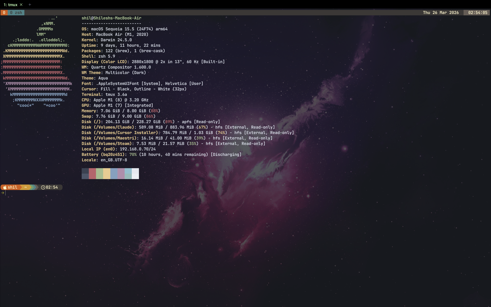

# dotfiles

terminal config to replicate on other machines

## configs

| file | tool |
|------|------|
| `.zshrc` | zsh shell |
| `.tmux.conf` | tmux |
| `starship.toml` | starship prompt |
| `wezterm.lua` | wezterm terminal |
